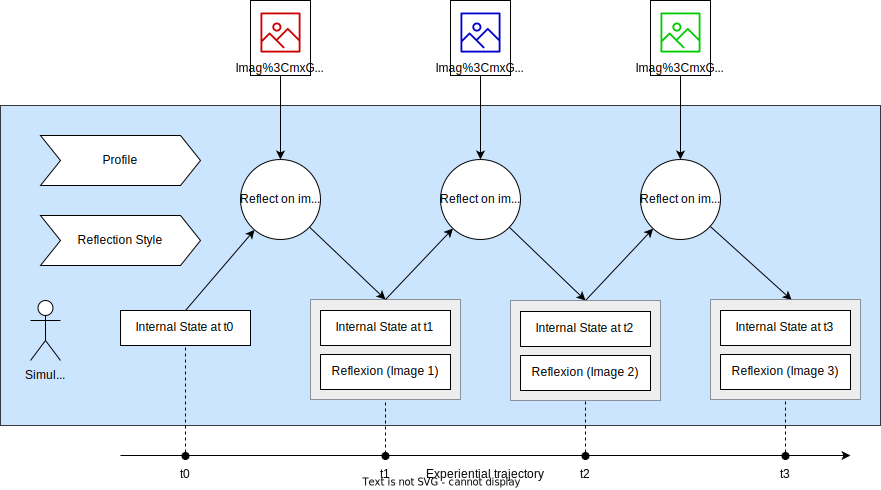

# Stateful Viewers

*A viewer whose perception evolves with each image*

Stateful Viewers is an art and research project that simulates a visitor walking through a gallery. A vision-language model reflects on images one at a time, carrying forward memory, attention, and affect so that each encounter subtly shapes how subsequent images are perceived.

Rather than treating images as independent inputs, the system models viewing as a continuous, cumulative experience.

### Stateful Viewing Process



Each viewer has a **Profile** (perceptual dispositions), a **Reflection Style** (expressive voice), and an evolving **Internal State** (momentary inner condition). For each image, the model is conditioned on the image plus these viewer attributes, and outputs both a **Reflection** and an **Updated Internal State**. That updated state carries forward to the next image, creating a continuous experiential trajectory across encounters.

## Features

- **Viewer setup (decoupled)** -- Generate or load a viewer profile, a reflection style, and an initial internal state as separate artifacts. Variability is ensured by parametric hints that randomly pin 2-4 of 7 dimensions per schema and let the LLM resolve the rest.
- **Public & Saved viewer artifacts** -- Load pre-generated public artifacts (tracked in git) and/or your own saved ones. Lists are filtered by locale (EN/FR), but not by LLM provider — you can mix a profile generated by one LLM with reflections from another (and a style/state generated elsewhere). On Hugging Face Spaces, user-created artifacts are stored per-browser (localStorage) so they are not shared across users.
- **English + French (EN/FR)** -- UI localization, locale-aware scraping (gallery names/sections/descriptions/captions), and locale-aware generation/TTS
- **Multiple Model Providers** -- Use Ollama locally (LLaVA-1.6 7B for vision + Llama 3.1 8B Instruct for text) or cloud providers (OpenAI GPT-5.2, Google Gemini 3 Pro (preview), Anthropic Claude Sonnet 4.6)
- **Stateful Reflections** -- Each reflection is conditioned by the viewer profile, reflection style, and an evolving internal state. On the first image the system uses the generated initial state; subsequent images carry forward the state from the previous reflection.
- **Structured Output** -- Reflections use `[REFLECTION]` and `[STATE]` blocks for clear parsing
- **Text-to-Speech** -- Listen to reflections with customizable voice
- **Auto Voice-Over** -- Automatically play reflections during walk-through mode
- **Walk-Through Mode** -- Automated guided tour with sequential image viewing
- **Reflection History** -- Timeline of all reflections with quick navigation
- **Summarize Trajectory** -- Generate a short narrative summary of how the experience moved through the gallery (phenomenological, non-reductive)
- **Export** -- Export reflection sessions to Markdown and JSON for archiving, sharing, or downstream analysis

## Images & Copyright

Images displayed in this application are served from [fredericbenard.com](https://www.fredericbenard.com) (bilingual EN/FR galleries and captions).

**Copyright 1990-2026 Frederic Benard. All rights reserved.**

These images are not part of the open-source repository and may not be copied, reused, or redistributed without permission.

## Prerequisites

### Node.js

Vite 7 requires **Node.js 20.19+** (or **22.12+**).

### Local Models (Ollama)

```bash
# Pull the vision model (VLM)
ollama pull llava:7b

# Pull the text model for profile and style generation
ollama pull llama3.1:8b-instruct-q5_K_M

# Start Ollama (usually runs automatically)
ollama serve
```

### Cloud Models (OpenAI, Google Gemini, Anthropic)

This app uses **BYOK (bring your own key)**:

- Users paste API keys in the app UI (**Settings > API Keys**).
- Keys are stored in the browser and forwarded in request headers; the server does not store them.

Get keys from:
- **OpenAI** -- [platform.openai.com/api-keys](https://platform.openai.com/api-keys)
- **Google Gemini** -- [aistudio.google.com/apikey](https://aistudio.google.com/apikey)
- **Anthropic** -- [console.anthropic.com](https://console.anthropic.com/)

## Setup

```bash
npm install
```

## Run

```bash
npm run dev
```

Open [http://localhost:5173](http://localhost:5173).

In dev, `npm run dev` starts:
- **Vite** (frontend)
- **Node/Express** on `http://localhost:8787` (the app API server). Vite proxies `/api/*` to it.

**Language:**

- The app detects locale from the browser and persists your choice in localStorage.
- You can switch **EN/FR** via the footer toggle.

### Deploy to Hugging Face Spaces

The app can be deployed to [Hugging Face Spaces](https://huggingface.co/spaces) as a **Docker** Space. Users bring their own API keys (BYOK) via the in-app Settings; no keys are stored on the server. Ollama is not available on HF (the UI falls back to cloud providers). For step-by-step instructions, see **[docs/deploy-huggingface.md](docs/deploy-huggingface.md)**.

## Usage

### 1. Set up the Viewer (Profile / Style / Initial State)

Before selecting a gallery, set up three independent viewer artifacts in the sidebar:

- **Profile** (7 dimensions) — stable perceptual dispositions (tolerance for ambiguity, attention style, embodied orientation, interpretive posture, aesthetic conditioning, motivational stance, memory integration tendency)
- **Reflection style** (7 dimensions) — expressive voice (lexical register, emotion explicitness, voice stability, sensory modality, self-reference, metaphor density, pacing)
- **Initial internal state** (7 dimensions) — arrival snapshot (dominant mood, tension/ease, energy, openness, focus, meaning pressure, somatic activation)

For each artifact:

- **Generate** — creates the artifact plus a short user-facing summary and a concise label.
- **Select** — choose from public + saved artifacts. Lists are filtered by locale (switch EN/FR to see the corresponding artifacts), but not by provider, so you can mix providers across profile/style/state and reflections.

Each generation uses parametric hints: 2–4 dimensions are randomly pinned to specific values from a pool, and the LLM resolves the rest to form a coherent whole.

### 2. Select a Gallery

Choose from the scraped galleries. Gallery sections and names follow the selected locale (EN/FR). Images are loaded from fredericbenard.com.

### 3. Reflect on Images

- **Manual Reflection** -- Click **"Reflect on this image"**
- **Walk-Through Mode** -- Click **"Start walk-through"** for an automated sequence:
  - Reflects on each image in order
  - Auto-advances after voice-over completes (if enabled) or after a short delay
  - Can be paused or stopped at any time

### 4. Listen to Reflections

- Click **"Listen"** to hear a reflection
- Adjust **Voice** (browser-provided voices)
- Enable **"Auto voice-over"** to play reflections automatically

### 5. Navigate History

The **Reflection History** panel shows all reflections in sequence. Click any entry to jump directly to that image.

### 6. Summarize Trajectory

After reflecting on at least one image, use **"Summarize trajectory"** to get a short narrative summary of how the experience moved (e.g. gradual settling, oscillation, depletion). This uses the same text LLM as the reflection provider; the summary appears below the buttons.

## How It Works

### Viewer Profile System

The architecture uses 4 independent generation stages: **Profile**, **Reflection Style**, **Initial State**, and **Stateful Reflection**. Each of the first three stages defines 7 theoretically grounded dimensions.

**Profile Generation**
Creates a stable perceptual and interpretive disposition -- how the viewer characteristically attends to, processes, and makes meaning from visual art. The 7 profile dimensions are:

1. Tolerance for ambiguity (low to high)
2. Attention style (absorbed/dwelling to scanning/restless)
3. Embodied orientation (somatic to cognitive)
4. Interpretive posture (literal/descriptive to symbolic/associative to autobiographical)
5. Aesthetic conditioning (naive to highly conditioned, with art background)
6. Motivational stance (seeking challenge/novelty to seeking comfort/familiarity)
7. Memory integration tendency (integrative/accumulative to discrete/reset)

**Reflection Style** (independent of profile)
Defines how experience is expressed in language -- the texture, rhythm, and habits of inner speech. The 7 style dimensions are:

1. Lexical register (plain/conversational to literary/poetic)
2. Emotion explicitness (implicit/suggested to explicit/named)
3. Voice stability (steady/composed to fragmented/shifting)
4. Sensory modality emphasis (visual, kinesthetic, auditory, or mixed)
5. Self-reference mode (first-person intimate to observational/impersonal)
6. Metaphor density (spare/literal to rich/figurative)
7. Pacing (terse/compressed to expansive/flowing)

**Initial Internal State**
A momentary snapshot of the viewer's inner condition at the moment they enter the gallery, before encountering any images. Uses the same 7-dimension schema as the evolving state:

1. Dominant mood
2. Underlying tension or ease
3. Energy and engagement
4. Emotional openness
5. Attentional focus
6. Meaning-making pressure
7. Somatic activation

**Parametric variability**
Rather than using fixed hint variants, generation uses parametric hints (ported from the research evaluation pipeline). For each generation, 2-4 of the 7 dimensions are randomly pinned to specific values sampled from a pool, and the LLM resolves the remaining dimensions to form a coherent whole. This is defined in `src/prompts.ts` and shared by both the app and the offline generation script.

**Saved profiles**
When you generate a profile **while running the dev server** (`npm run dev`), it is written to `data/profiles/<uuid>.json` (and also cached in localStorage). On Hugging Face Spaces, generated artifacts are saved to localStorage only (per-browser; not written to the server disk). The file includes: UUID, generation timestamp, locale, LLM used, label, and profile text (long + short).

**Saved reflection styles**
When you generate a reflection style (dev server), it is written to `data/styles/<uuid>.json` (and also cached in localStorage). On Hugging Face Spaces, generated artifacts are saved to localStorage only (per-browser; not written to the server disk). The file includes: UUID, generation timestamp, locale, LLM used, and reflection style text (long + short).

**Saved initial states**
When you generate an initial internal state (dev server), it is written to `data/states/<uuid>.json` (and also cached in localStorage). On Hugging Face Spaces, generated artifacts are saved to localStorage only (per-browser; not written to the server disk). The file includes: UUID, generation timestamp, locale, LLM used, and initial state text (long + short).

**Public artifacts**
Pre-generated public artifacts live in:

- `data/profiles/public/` (profiles; EN + FR)
- `data/styles/public/` (reflection styles; EN + FR)
- `data/states/public/` (initial states; EN + FR)

They are generated offline using:

- `scripts/generate-profiles.ts`
- `scripts/generate-styles.ts`
- `scripts/generate-states.ts`

The server can still *fallback-extract* a style/state from a profile file if legacy bundled fields (`reflectionStyle`, `initialState`) exist, but the offline generators now produce separated artifacts by default.

**Loading**
The dev server exposes:

- `/api/list-profiles` and `/api/load-profile?id=<uuid>`
- `/api/list-styles` and `/api/load-style?id=<uuid>`
- `/api/list-states` and `/api/load-state?id=<uuid>`

The UI uses these to list and load all artifacts (public + saved) without filtering by provider.

### Stateful Reflections

Each reflection:

- Incorporates the viewer profile and reflection style
- Uses the initial state for the first image, then carries forward the evolving state
- Evolves gradually unless an image is strongly disruptive
- Outputs structured `[REFLECTION]` and `[STATE]` blocks

**Saved reflection sessions**
When you reflect on images with a profile that was successfully saved **and** the dev server is running, each reflection auto-saves the full session to `data/reflections/<profileId>_<galleryId>_<sessionStartedAt>.json`. One file per (profile, gallery) run is updated in place after every new reflection. The file embeds gallery metadata, profile, reflection style, initial internal state, all reflections so far, last internal state, and, if applicable, trajectory summary. (On Hugging Face Spaces, reflection-session autosave is disabled to avoid writing user data to a shared server filesystem.)

**LLM provenance in exports**
Exported data (markdown and JSON) tracks five separate LLM contexts:

- `profileLlm` / `profileLlmModelLabel` -- which LLM generated the profile
- `styleLlm` / `styleLlmModelLabel` -- which LLM generated the reflection style (if tracked)
- `stateLlm` / `stateLlmModelLabel` -- which LLM generated the initial state (if tracked)
- `reflectionVlm` / `reflectionVlmModelLabel` -- which vision model processed the images
- `reflectionLlm` / `reflectionLlmModelLabel` -- which text LLM generated the trajectory summary

These may all be different if you load a profile generated by one provider and reflect with another.

### Experiential Trajectory Analysis

Reflection sessions can be treated as **experiential trajectories**: ordered paths of internal state and reflection through a gallery, shaped by profile and reflection style. Analysis stays qualitative and phenomenological -- no valence/arousal or sentiment scores.

**In the app**
Use **"Summarize trajectory"** in the Reflection history section (after reflecting on at least one image) to get a narrative summary of the current run.

**Data model**

- `src/lib/trajectory.ts` -- Defines `ExperientialTrajectory` and `trajectoryFromSession(session)`. A trajectory is an ordered sequence of steps (reflection text + internal state per image), plus gallery and viewer context.

**Narrative summarization**

- `src/lib/analyzeTrajectory.ts` -- `generateNarrativeSummary(trajectory, initialState, provider, locale)` produces a short reflective summary of how the experience moved (e.g. gradual settling, oscillation, depletion, drift). In the UI this is triggered by the button in the Reflection history section; programmatically, load a session from `data/reflections/*.json`, convert with `trajectoryFromSession()`, then call `generateNarrativeSummary()` with your chosen LLM provider and target locale.

## Research

The `research/` directory contains the evaluation pipeline used to develop and validate the v2 prompt architecture. It includes:

- **Parametric variant generation** (`research/eval_pipeline/parametric.py`) -- the dimension pools and subset-sampling logic that the app's TypeScript parametric hints are ported from
- **Experiments** for profile generation, style generation, initial state generation, and stateful reflection (with high/low ambiguity variants)
- **Evaluation criteria** and **provenance tracking** for each experiment
- **Evaluation reports** (methodology, results, analysis) in `research/docs/evaluation/`

See `research/docs/README.md` for details.

## Research Positioning

Stateful Viewers draws on reception theory, phenomenology, and aesthetic psychology. It models a viewer's perceptual stance prior to viewing, maintains a stable expressive voice across images, and treats emotional response as something that unfolds over time.

The system operationalizes qualitative theories of aesthetic experience within a structured generative framework, without reducing experience to numerical scores or fixed emotion labels.

For deeper background, see:

- [Art and emotions (lit review)](research/docs/literature/art-and-emotions.md) — ambiguity, “being moved”, embodied response, temporal unfolding
- [v2 dimensions (design)](research/docs/design/v2-dimensions.md) — theoretical grounding for profile × style × internal state

### Prompt-to-Research Mapping

| Prompt              | Research Anchor                                                | Core Thinkers                  |
| ------------------- | -------------------------------------------------------------- | ------------------------------ |
| Viewer Profile      | Reception theory, phenomenology of perception                  | Jauss, Merleau-Ponty, Gombrich |
| Reflection Style    | Inner speech, narrative psychology, phenomenological reduction | Vygotsky, Bruner, Husserl      |
| Initial State       | Situatedness, pre-reflective experience, embodied entry        | Merleau-Ponty, Husserl, Dewey  |
| Stateful Reflection | Aesthetic experience as process, affect dynamics               | Dewey, Tomkins                 |

### Relation to Affective Computing

While the system tracks internal state over time, it differs fundamentally from affective computing. Rather than detecting, classifying, or predicting emotion, it models aesthetic experience as situated, qualitative, and temporally unfolding.

Emotional state is treated as one component of lived experience, expressed through a stable reflective voice and shaped by prior orientation, attention style, and aesthetic conditioning.

Where affective computing often asks what emotion is present, Stateful Viewers asks *what it is like to encounter this image, having already encountered the previous ones.*

| Dimension         | Affective Computing       | Stateful Viewers          |
| ----------------- | ------------------------- | ------------------------- |
| Goal              | Detect / classify emotion | Simulate lived experience |
| View of the human | Signal source             | Situated subject          |
| Emotion           | Target variable           | Embedded component        |
| Representation    | Numeric / categorical     | Qualitative / narrative   |
| Time              | Discrete steps            | Continuous accumulation   |
| Ambiguity         | Minimized                 | Preserved                 |
| Outcome           | Prediction / adaptation   | Reflection / articulation |

## Project Structure

- `docs/` -- Architecture diagram (`architecture.png` / `architecture.drawio`) and deployment guide ([deploy-huggingface.md](docs/deploy-huggingface.md))
- `data/profiles/public/` -- Pre-generated public profiles (EN + FR pairs)
- `data/profiles/` -- User-generated profiles (gitignored)
- `data/styles/public/` -- Pre-generated public reflection styles (EN + FR pairs)
- `data/styles/` -- User-generated reflection styles (gitignored)
- `data/states/public/` -- Pre-generated public initial states (EN + FR pairs)
- `data/states/` -- User-generated initial states (gitignored)
- `data/reflections/` -- Auto-saved reflection sessions (gitignored)
- `research/` -- Evaluation pipeline, experiments, and parametric variant generation
- `scripts/generate-profiles.ts` -- Generate public profiles (EN + FR) offline
- `scripts/generate-styles.ts` -- Generate public reflection styles (EN + FR) offline
- `scripts/generate-states.ts` -- Generate public initial states (EN + FR) offline
- `scripts/scrape-galleries.ts` -- Gallery scraper
- `scripts/retrofit-labels.ts` -- Re-generate (or backfill) artifact labels using a selected provider
- `src/data/galleries.ts` -- Gallery data types
- `src/data/galleries.en.json` -- Scraped gallery data (EN)
- `src/data/galleries.fr.json` -- Scraped gallery data (FR)
- `src/api/vision.ts` -- Unified vision API router
- `src/api/ollama.ts` -- Ollama/LLaVA-1.6 client
- `src/api/openai.ts` -- OpenAI client
- `src/api/gemini.ts` -- Gemini client
- `src/api/anthropic.ts` -- Anthropic client
- `src/api/llm.ts` -- Text-only LLM interface
- `src/prompts.ts` -- All prompt definitions: profile, style, initial state, label, short descriptions, stateful reflection, parametric hint generation
- `src/lib/parseReflection.ts` -- Parse `[REFLECTION]` / `[STATE]` blocks
- `src/lib/exportSession.ts` -- Export session data (markdown + JSON, with separate LLM provenance)
- `src/lib/saveProfile.ts` -- Save generated profiles to `data/profiles/`
- `src/lib/loadProfile.ts` -- List and load profiles (public + saved, unfiltered)
- `src/lib/saveStyle.ts` -- Save generated reflection styles to `data/styles/`
- `src/lib/loadStyle.ts` -- List and load reflection styles
- `src/lib/saveState.ts` -- Save generated initial states to `data/states/`
- `src/lib/loadState.ts` -- List and load initial states
- `src/lib/saveReflectionSession.ts` -- Auto-save reflection sessions to `data/reflections/`
- `src/lib/trajectory.ts` -- Experiential trajectory types and `trajectoryFromSession()`
- `src/lib/analyzeTrajectory.ts` -- Phenomenological analysis (narrative summary; extensible)
- `src/hooks/useSpeech.ts` -- Text-to-speech utilities
- `src/App.tsx` -- Main UI and state management

## Scripts

Note: when using `npm run <script>`, add `--` before script args (so npm forwards them). For example:

```bash
npm run retrofit-labels -- --only-missing --llm openai --model gpt-5.2
```

The offline scripts below read API keys from `.env` for convenience (these are **not needed to run the app** — the app uses BYOK in Settings). To set up scripting keys, copy `.env.example` to `.env` and fill in the values you need.

**Refresh gallery data** -- To refresh galleries from fredericbenard.com:

```bash
npm run scrape
```

This updates `src/data/galleries.en.json` and `src/data/galleries.fr.json`.

**Generate public profiles** -- To generate (or regenerate) the public profiles (profile-only JSONs):

```bash
npx tsx scripts/generate-profiles.ts
```

Generates 1 EN profile with parametric hints and writes it to `data/profiles/public/`. Use `--translate-fr` to also generate a translated FR version.

This script supports multiple providers (default: OpenAI). Examples:

```bash
# OpenAI (default)
npx tsx scripts/generate-profiles.ts --llm openai --model gpt-5.2

# Anthropic / Claude
npx tsx scripts/generate-profiles.ts 3 --llm anthropic --model claude-sonnet-4-6

# Gemini (defaults to maxOutputTokens=4096 unless you override)
npx tsx scripts/generate-profiles.ts 3 --llm gemini --model gemini-3-pro-preview

# Ollama (local)
npx tsx scripts/generate-profiles.ts 3 --llm ollama --model llama3.1:8b-instruct-q5_K_M
```

Flags:

- `[count]` (positional; optional; default 1)
- `--llm openai|anthropic|gemini|ollama`
- `--model <model>` (optional)
- `--temperature <n>` (optional)
- `--max-tokens <n>` (optional; per-call output cap for the long fields; Gemini defaults to 4096)
- `--translate-fr` (optional; also writes a translated FR artifact for each generated EN artifact)

**Generate public styles** -- To generate (or regenerate) the public reflection styles (style-only JSONs):

```bash
npx tsx scripts/generate-styles.ts
```

Generates 1 EN style with parametric hints and writes it to `data/styles/public/`. Use `--translate-fr` to also generate a translated FR version.

**Generate public states** -- To generate (or regenerate) the public initial states (state-only JSONs):

```bash
npx tsx scripts/generate-states.ts
```

Generates 1 EN initial state with parametric hints and writes it to `data/states/public/`. Use `--translate-fr` to also generate a translated FR version.

**Retrofit / re-generate labels** -- Overwrite labels using a selected LLM provider (public + saved artifacts).

By default it targets **all artifact types**. You can choose which artifact types to retrofit:

- `--profiles`
- `--styles`
- `--states`
- `--all` (profiles + styles + states)

```bash
npm run retrofit-labels -- --llm openai --model gpt-5.2
```

Only backfill labels that are missing (do not overwrite existing labels):

```bash
npm run retrofit-labels -- --only-missing
```

Only retrofit a specific locale (skips artifacts without an explicit `locale` field):

- `--locale en|fr`
- `--only-fr` (shorthand for `--locale fr`)

```bash
# FR artifacts only
npm run retrofit-labels -- --only-fr
```

Examples:

```bash
# Styles only
npm run retrofit-labels -- --styles --llm openai --model gpt-5.2

# All artifacts, only missing labels
npm run retrofit-labels -- --all --only-missing --llm openai --model gpt-5.2

# FR profiles only
npm run retrofit-labels -- --only-fr --profiles --llm openai --model gpt-5.2
```

This updates the `label` field only; it does not change the original profile provenance fields. See `scripts/retrofit-labels.ts`.

Common variables:

- `OPENAI_API_KEY`
- `GOOGLE_API_KEY`
- `ANTHROPIC_API_KEY`
- `OLLAMA_BASE_URL` (optional; defaults to `http://localhost:11434`)

The script supports `--llm openai|anthropic|gemini|ollama` and an optional `--model <model>`.

## Technical Notes

- **Vision Models**: LLaVA-1.6 7B (Ollama), GPT-5.2, Gemini 3 Pro (preview), Claude Sonnet 4.6
- **Text Models**: Llama 3.1 8B Instruct (Q5_K_M quantized) (Ollama), GPT-5.2, Gemini 3 Pro (preview), Claude Sonnet 4.6
- **API Proxying**: In dev, the frontend calls `/api/*`; Vite proxies most `/api/*` to the local Node/Express server, which proxies cloud providers. `/api/ollama/*` is proxied directly to Ollama for local usage.
- **Image Source**: Images proxied from fredericbenard.com
- **State Management**: React hooks with per-gallery state tracking
- **Text-to-Speech**: Web Speech API
- **LLM Provenance**: Profile/style/state generation can be tracked separately from the reflection VLM/LLM, enabling cross-provider workflows with better traceability in exports.
- **Saved data** (local dev): generated artifacts are written to `data/profiles/`, `data/styles/`, `data/states/` and sessions to `data/reflections/` (gitignored), while public artifacts live in `data/*/public/` (checked in). On Hugging Face Spaces, user-created profile/style/state artifacts are stored per-browser in localStorage (not on the server disk), and reflection-session autosave is disabled. Saving/loading endpoints still exist, and the UI merges server-public artifacts with local ones.

For production deployment to a static host, a backend is required to proxy cloud model requests and (if you want persistence) to provide save endpoints. **Hugging Face Spaces** is supported: use a Docker Space and follow [docs/deploy-huggingface.md](docs/deploy-huggingface.md); the repo's Dockerfile and frontmatter (`sdk: docker`, `app_port: 7860`) are already configured for HF.

## References

**Phenomenology & Perception**

- Merleau-Ponty, M. (2012). *Phenomenology of perception* (D. A. Landes, Trans.). Routledge. (Original work published 1945)
- Husserl, E. (1982). *Ideas pertaining to a pure phenomenology and to a phenomenological philosophy, First Book* (F. Kersten, Trans.). Springer. (Original work published 1913)

**Reception Theory & Viewer Orientation**

- Jauss, H. R. (1982). *Toward an aesthetic of reception* (T. Bahti, Trans.). University of Minnesota Press.
- Gombrich, E. H. (1960). *Art and illusion: A study in the psychology of pictorial representation*. Princeton University Press.

**Empirical Aesthetics & Aesthetic Emotion**

- Leder, H., Belke, B., Oeberst, A., & Augustin, D. (2004). A model of aesthetic appreciation and aesthetic judgments. *British Journal of Psychology*, 95(4), 489–508.
- Silvia, P. J. (2005). Emotional responses to art: From collation and arousal to cognition and emotion. *Review of General Psychology*, 9(4), 342–357.
- Pelowski, M., Markey, P. S., Forster, M., Gerger, G., & Leder, H. (2017). Move me, astonish me… delight my eyes and brain: The Vienna Integrated Model of top-down and bottom-up processes in Art Perception (VIMAP) and corresponding affective, evaluative, and neurophysiological correlates. *Physics of Life Reviews*, 21, 80–125.

**Ambiguity, Interest, and Optimal Complexity**

- Berlyne, D. E. (1971). *Aesthetics and psychobiology*. Appleton-Century-Crofts.
- Jakesch, M., & Leder, H. (2009). Finding meaning in art: Preferred levels of ambiguity in art appreciation. *Quarterly Journal of Experimental Psychology*, 62(11), 2105–2112.

**Aesthetic Experience as Process**

- Dewey, J. (2005). *Art as experience*. Perigee Books. (Original work published 1934)

**Inner Speech, Narrative, and Expression**

- Vygotsky, L. S. (1986). *Thought and language* (A. Kozulin, Trans.). MIT Press. (Original work published 1934)
- Bruner, J. (1990). *Acts of meaning*. Harvard University Press.

**Embodiment, “Being Moved”, and Neuroaesthetics**

- Wassiliwizky, E., Wagner, V., Jacobsen, T., & Menninghaus, W. (2015). Art-elicited chills indicate states of being moved. *Psychology of Aesthetics, Creativity, and the Arts*, 9(4), 413–427.
- Vessel, E. A., Starr, G. G., & Rubin, N. (2012). The brain on art: Intense aesthetic experience activates the default mode network. *Frontiers in Human Neuroscience*, 6, 66.
- Chatterjee, A., & Vartanian, O. (2014). Neuroaesthetics. *Trends in Cognitive Sciences*, 18(7), 370–375.

**Affect Theory & Affective Computing (for contrast)**

- Picard, R. W. (1997). *Affective computing*. MIT Press.
- Russell, J. A. (1980). A circumplex model of affect. *Journal of Personality and Social Psychology*, 39(6), 1161-1178.
- Tomkins, S. S. (1962). *Affect, imagery, consciousness: Vol. 1. The positive affects*. Springer.
